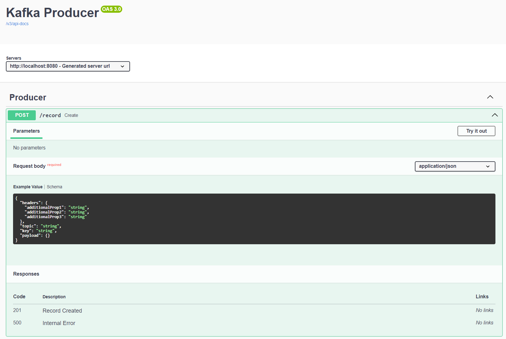

# Kafka Producer REST API (Hello World Kafka)

Simple Spring Boot project that exposes a REST endpoint to publish messages to Kafka.
It also includes:
- OpenAPI/Swagger UI for API exploration
- Kafka UI (via Docker) to inspect topics/messages
- A small Kafka Streams enrichment flow

## Tech Stack

- Java 25
- Spring Boot 4
- Spring Kafka
- Apache Kafka (KRaft mode, Docker)
- Maven
- Springdoc OpenAPI

## Project Features

- Produce Kafka records through a REST endpoint (`POST /record`)
- Send `topic`, `key`, `payload`, and optional headers
- Consume and log produced messages
- Stream enrichment from `default-topic` -> `default-topic-enrich`

## Prerequisites

- Java 25+
- Docker + Docker Compose
- Maven (or use `./mvnw`)

## Quick Start

### 1) Start Kafka + Kafka UI (Docker)

From project root:

```bash
docker compose up -d
```

This starts:
- Kafka broker on `localhost:9092`
- Kafka UI on `localhost:8081`

### 2) Run the API

```bash
./mvnw spring-boot:run
```

On Windows (PowerShell):

```powershell
.\mvnw.cmd spring-boot:run
```

The API starts on `http://localhost:8080`.

## Useful URLs

- Swagger UI: `http://localhost:8080/swagger-ui/index.html`
- OpenAPI JSON: `http://localhost:8080/v3/api-docs`
- Kafka UI (Docker): `http://localhost:8081`

## API Example

Endpoint:

```http
POST /record
Content-Type: application/json
```

Sample request body:

```json
{
  "headers": {
    "source": "readme-example"
  },
  "topic": "default-topic",
  "key": "hello-key",
  "payload": {
    "message": "hello kafka"
  }
}
```

Example cURL:

```bash
curl -X POST "http://localhost:8080/record" \
  -H "Content-Type: application/json" \
  -d '{
    "headers": { "source": "readme-example" },
    "topic": "default-topic",
    "key": "hello-key",
    "payload": { "message": "hello kafka" }
  }'
```

## Stopping Services

```bash
docker compose down
```

## Screenshot

